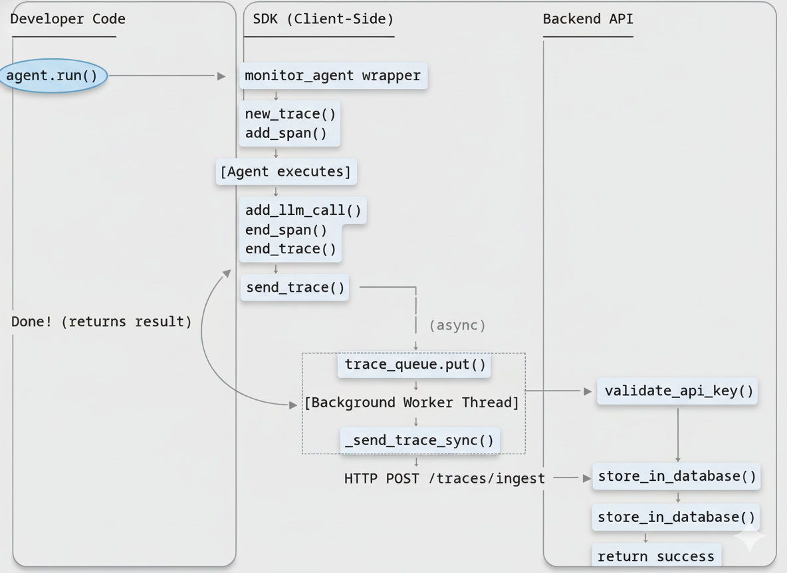

# AgentOps Monitor

Production-grade observability for Google ADK agents with **2 lines of code**.

[](https://pypi.org/project/agentops-monitor)
[](https://www.python.org/downloads/)
[](https://opensource.org/licenses/MIT)

**🌐 Live Demo:** [agentops.vercel.app](https://agentops.vercel.app)

---

## 📋 Table of Contents

- [Problem Statement](#problem-statement)
- [Solution](#solution)
- [Architecture](#architecture)
- [Setup Instructions](#setup-instructions)
- [Usage](#usage)
- [Features](#features)
- [Tech Stack](#tech-stack)
- [Documentation](#documentation)
- [Contributing](#contributing)

---

## Problem Statement

Deploying AI agents to production without observability is like flying blind. When Google ADK agents fail or produce unexpected results, developers face critical challenges:

- **Zero visibility** into which LLM calls succeeded or failed
- **No tracking** of tool invocations and their inputs/outputs
- **Unknown costs** - token usage and expenses are invisible until the bill arrives
- **Impossible debugging** - no execution traces to understand agent behavior
- **No performance insights** - latency bottlenecks remain hidden

Existing monitoring solutions either:

- Require extensive code changes to integrate
- Don't understand ADK-specific patterns (runner orchestration, A2A communication, session state)
- Lock you into expensive proprietary platforms with no self-hosting option

**The gap:** There was no ADK-native, self-hostable observability platform that could be integrated with minimal code changes.

---

## Solution

AgentOps Monitor provides **complete observability for Google ADK agents** with just **2 lines of code**:

```python
from agentops_monitor import monitor_agent

agent = monitor_agent(agent, api_key)  # That's it!
```

### What It'll helps in:

- 🔍 **Full Execution Traces** - Capture every LLM prompt/response, tool call, and A2A message
- 💰 **Real-Time Cost Tracking** - Monitor token usage and costs per interaction
- ⚡ **Performance Metrics** - Identify latency bottlenecks with execution timelines
- 🐛 **Error Tracking** - Get stack traces with full context when failures occur
- 📊 **Visual Dashboard** - Interactive timeline views and session replays
- 🚀 **Non-Blocking** - Async trace sending with <5ms overhead
- 🔐 **Self-Hostable** - Deploy with Docker Compose in 5 minutes

### Key Innovation

Unlike generic LLM monitoring tools, AgentOps Monitor especially for **Google ADK**:

✅ Understands agent hierarchies and sub-agent relationships  
✅ Captures runner-level orchestration, not just individual LLM calls  
✅ Tracks tool invocations with full input/output context  
✅ Supports agent-to-agent (A2A) communication monitoring  
✅ Preserves multi-turn conversation and session state structure

---

## Architecture

AgentOps Monitor consists of three tightly integrated components:

### System Architecture Diagram

```
┌─────────────────────────────────────────────────────────────┐
│                     Developer's Application                 │
│                                                             │
│   agent = Agent(name="MyAgent", model="gemini-2.5-flash")   │
│   agent = monitor_agent(agent, api_key)  ← 2 lines of code  │
│                           ↓                                 │
└─────────────────────────────────────────────────────────────┘
                            │
          ┌─────────────────┼─────────────────┐
          │                 │                 │
    ┌─────▼──────┐    ┌─────▼──────┐    ┌─────▼───────┐
    │ Python SDK │    │   Backend  │    │  Dashboard  │
    │   (PyPI)   │──▶│  (FastAPI) │──▶│  (Next.js)  │
    │            │    │  Supabase  │    │             │
    └────────────┘    └────────────┘    └─────────────┘
         │                  │                  │
    Captures Data     Stores Traces     Visualizes Results
```

### Component Breakdown

**1. Python SDK (Published to PyPI)**

- Lightweight wrapper around ADK agents, runners, and tools
- Intercepts ADK's callback system to capture execution data
- Asynchronous trace sending via background worker thread
- Zero-config setup with environment variables
- **Integration time: 2 lines of code**

**2. Backend API (FastAPI + Supabase)**

- High-performance trace ingestion endpoint (`/traces/ingest`)
- Multi-tenant architecture with API key authentication
- Project isolation - users only see their own traces
- RESTful API for querying traces, analytics, and metrics
- Dockerized for one-command deployment

**3. Frontend Dashboard (Next.js + TypeScript)**

- Real-time trace visualization with interactive timelines
- Detailed span inspection (inputs, outputs, execution flow)
- Cost and token usage analytics aggregated by project
- API key management and project organization
- Modern, responsive UI built for developer productivity

### Code Execution Flow Diagram



**How it works:**

1. **Agent Wrapping** - `monitor_agent()` intercepts ADK callbacks
2. **Execution Capture** - SDK captures traces, spans, LLM calls, and tool invocations
3. **Async Sending** - Traces queued in background thread (non-blocking)
4. **Backend Processing** - FastAPI validates API key and stores in Supabase
5. **Dashboard Visualization** - Next.js fetches and displays traces in real-time

**Technical Highlights:**

- **Async Queue Architecture**: <5ms overhead, never blocks agent execution
- **Context-Based Storage**: Thread-local storage tracks nested agent/tool calls
- **Callback Interception**: Uses ADK's native callbacks (not monkey-patching)
- **Retry with Exponential Backoff**: 3 retries (1s, 2s, 4s delays) for network failures
- **Graceful Degradation**: Backend failures never crash the agent

---

## Setup Instructions

### Prerequisites

- Python 3.8 or higher
- Docker and Docker Compose (for backend deployment)
- Supabase account (or local PostgreSQL)

### Step 1: Install the SDK

```bash
pip install agentops-monitor
```

### Step 2: Deploy the Backend

Clone the repository and start services with Docker Compose:

```bash
git clone https://github.com/sayandas24/agentops-monitor.git
cd agentops-monitor
docker compose up -d
```

Services will be running at:

- **Backend API**: `http://localhost:8000`
- **Dashboard**: `http://localhost:3000`
- **PostgreSQL**: `localhost:5432`

### Step 3: Configure Environment Variables

Create a `.env` file in your project:

```bash
AGENTOPS_API_KEY="your-api-key-here"
AGENTOPS_PROJECT_ID="your-project-id"
AGENTOPS_BASE_URL="http://localhost:8000"  # Optional, defaults to production
```

**Getting Your API Key:**

1. Open the dashboard at `http://localhost:3000`
2. Register an account
3. Create a new project
4. Generate an API key from project settings

### Step 4: Verify Installation

Test that everything is working:

```bash
# Check backend health
curl http://localhost:8000/health

# Verify SDK installation
python -c "from agentops_monitor import monitor_agent; print('✅ SDK installed')"
```

---

## Usage

### Basic Agent Monitoring

```python
from google.adk.agents import Agent
from agentops_monitor import monitor_agent
import os

# Create your agent
agent = Agent(
    name="CustomerSupport",
    model="gemini-2.5-flash",
    instruction="You are a helpful customer support agent."
)

# Wrap with monitoring (2 lines of code!)
agent = monitor_agent(agent, os.getenv("AGENTOPS_API_KEY"))

# Use normally - monitoring happens automatically
result = agent.run("How do I reset my password?")
print(result)
```

### Monitor Runners

```python
from google.adk.runners import Runner
from agentops_monitor import monitor_runner

runner = Runner(app=app, session_service=session_service)
monitored_runner = monitor_runner(runner, api_key="your-key")

# Runner execution is now fully traced
for event in monitored_runner.run(user_id="user123", session_id="session456", new_message=message):
    print(event)
```

### Wrap Custom Tools

```python
from google.adk.tools import google_search
from agentops_monitor import wrap_tool

# Wrap tools to track their usage
wrapped_search = wrap_tool(google_search)

agent = Agent(
    name="SearchAgent",
    tools=[wrapped_search],  # Use wrapped tool
    model="gemini-2.5-flash"
)
```

### Custom Function Tracing

```python
from agentops_monitor import traceable

@traceable(name="data_processing")
def process_data(data):
    # Your custom logic here
    result = transform(data)
    return result

# Function calls are automatically traced
result = process_data(my_data)
```

### View Traces in Dashboard

Once your agent is running, open the dashboard:

- **Live Demo**: [agentops.vercel.app](https://agentops.vercel.app)
- **Local**: `http://localhost:3000`

You'll see:

- Real-time trace timeline as agents execute
- Detailed span inspection with inputs/outputs
- Token counts and costs per interaction
- Error tracking with full stack traces

---

## Features

### Core Capabilities

- ✅ **2-Line Integration** - `monitor_agent(agent, api_key)` is all you need
- ✅ **ADK-Native** - Built specifically for Google ADK patterns
- ✅ **Non-Blocking** - Async trace sending with <5ms overhead
- ✅ **Self-Hostable** - Full control with Docker Compose deployment
- ✅ **Production-Ready** - Retry logic, error handling, graceful degradation

### Monitoring Coverage

- 🤖 **Agent Execution** - Full traces of agent.run() calls
- 🛠️ **Tool Calls** - Capture tool inputs, outputs, and errors
- 💬 **LLM Calls** - Model name, tokens, costs, prompts, responses
- 🔄 **A2A Communication** - Agent-to-agent message tracking
- 📦 **Session State** - Multi-turn conversation context
- 🏃 **Runner Orchestration** - Workflow-level visibility

### Dashboard Features

- 📊 Interactive execution timelines
- 🔍 Detailed span inspection
- 💰 Cost analytics by model and agent
- ⚡ Performance metrics and bottleneck identification
- 🐛 Error tracking with context
- 🔑 API key management
- 📁 Project organization

---

## Tech Stack

### SDK

- **Language**: Python 3.8+
- **Framework**: Google ADK
- **HTTP Client**: httpx (async)
- **State Management**: contextvars (thread-local storage)

### Backend

- **API Framework**: FastAPI
- **Database**: Supabase (PostgreSQL)
- **Validation**: Pydantic
- **Authentication**: JWT + API keys
- **Deployment**: Docker Compose

### Frontend

- **Framework**: Next.js (App Router)
- **Language**: TypeScript
- **Styling**: TailwindCSS
- **Charts**: Recharts
- **Data Fetching**: SWR

---

## Documentation

- 📖 [How It Works](./HOW_IT_WORKS.md) - Detailed architecture and data flow
- 🚀 [Deployment Guide](./DEPLOYMENT_GUIDE.md) - Production deployment instructions
- 🐳 [Docker Setup](./DOCKER_SETUP_GUIDE.md) - Docker configuration details
- 📦 [PyPI Publishing](./PYPI_PUBLISHING_GUIDE.md) - SDK publishing workflow
- 🎯 [Project Overview](./PROJECT_OVERVIEW.md) - Complete system overview

---

## Contributing

Contributions are welcome! Please feel free to submit a Pull Request.

1. Fork the repository
2. Create your feature branch (`git checkout -b feature/amazing-feature`)
3. Commit your changes (`git commit -m 'Add amazing feature'`)
4. Push to the branch (`git push origin feature/amazing-feature`)
5. Open a Pull Request

---

## License

This project is licensed under the MIT License - see the [LICENSE](LICENSE) file for details.

---

## Support

- 📖 [Documentation](./HOW_IT_WORKS.md)
- 🐛 [Issue Tracker](https://github.com/sayandas24/agentops-monitor/issues)
- 💬 [Discussions](https://github.com/sayandas24/agentops-monitor/discussions)

---

Built with ❤️ for the AI agent developer community.
